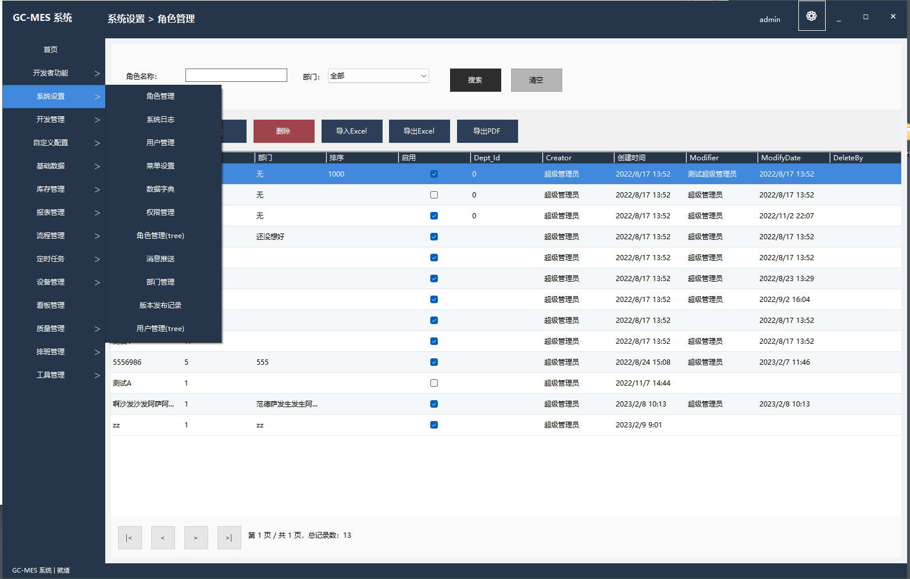
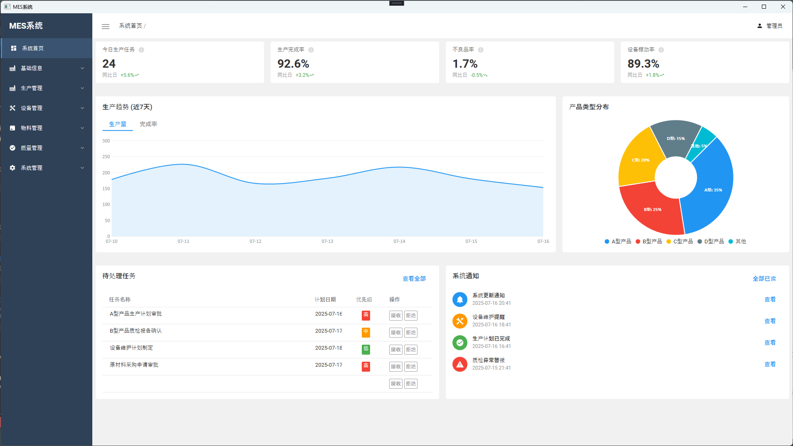
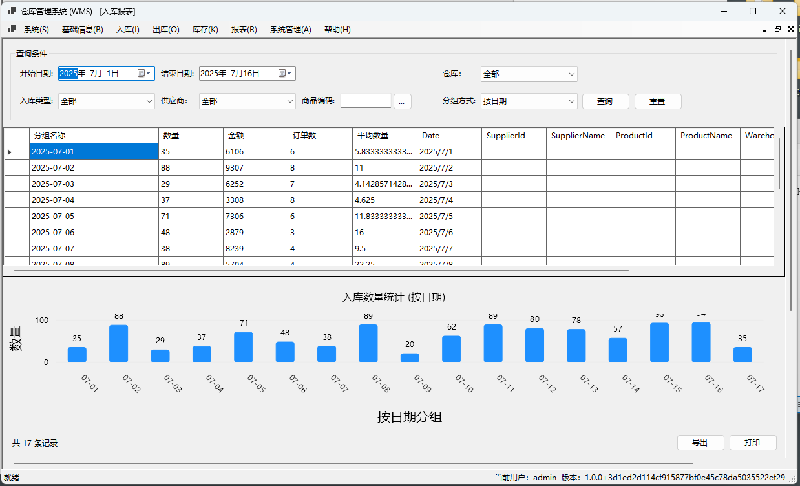
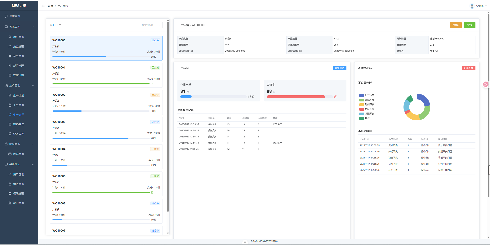

# [董润泽] | MES 工程师

<div align="center">
  <h3>👨‍💻 Manufacturing Systems Expert | C# Developer | Industrial Automation</h3>

  [](mailto:1749492810@qq.com)
  [](https://github.com/baitianbt)
</div>

## 关于我


制造执行系统 (MES) 工程师，工业软件开发。擅长使用 C#、WPF 和 Windows Forms 设计和实施定制制造解决方案。拥有车间设备与企业系统集成以及开发用于生产的的经验

## 关键技能

```
C# | WPF | Windows Forms | .NET | Vue.js | ASP.NET | SQL Server | OPC UA
```


## 📌 GitHub 项目预览

| 项目 | ⭐ Star | 🧰 技术栈 | 📄 简介 | 样式 |
|------|--------|-----------|--------|--------|
| [WinForm 开发框架](https://github.com/baitianbt/GC-MES) |  |    | 从零构建WinForm开发框，基于原生控件构建现代化风格的 | [](https://github.com/baitianbt/GC-MES) |
| [WPF.MES](https://github.com/baitianbt/MES_WPF) |  |    | 基于WPF的MES系统 | [](https://github.com/baitianbt/MES_WPF) |
| [Winform.WMS](https://github.com/baitianbt/WMS.Winform) |  |    | 基于winform构造的进存销管理系统 | [](https://github.com/baitianbt/WMS.Winform) |
| [MES.WEB](https://github.com//baitianbt/MES) |  |    | 前后端分离，支持用户权限、日志管理的后台管理系统 | [](https://github.com//baitianbt/MES) |


## 工作经历

**MES工程师** | Manufacturing Company | 2021-Present
- Designed and implemented custom MES solutions for multiple production lines
- Led integration of shop floor equipment with enterprise systems
- Reduced production data entry time by 45% through automation


<div align="center">

  

</div>

<!-- Replace 'yourusername' with your actual GitHub username -->
<!-- Replace all placeholder text with your actual information --> 
